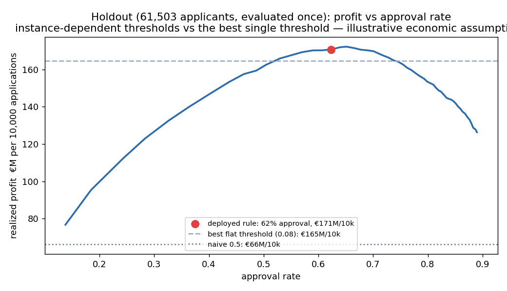

# Credit Risk Scoring System

**A deployed, calibrated, explainable credit-risk service with cost-based decisioning — a working system, not a notebook.**

▶ **Live demo:** _add your Hugging Face Space / Cloud Run URL here_ · `make demo` runs it locally
📄 [Technical reference](docs/TECHNICAL.md) · [Methodology](docs/METHODOLOGY.md) · [Improvement analysis](reports/IMPROVEMENT_ANALYSIS.md)

---

## The problem

A lender approving loans with a single 0.5 probability cutoff treats every mistake as equal. It is not: rejecting a good €10k one-year loan and approving a €200k seven-year default are different amounts of money. This system predicts default probability, **calibrates it so the number means what it says**, then gives every applicant their own approval threshold derived from that applicant's economics.

## The headline

> Against a naive 0.5 threshold, cost-optimal decisioning saves **104.5M currency units per 10,000 applications** — and against the *best possible single threshold*, still **+3.67% (6.0M CU per 10,000)**.
> *Measured once on a 61,503-applicant holdout, under stated illustrative economic assumptions. The Home Credit dataset specifies **no currency** (median borrower income 147,150, median loan 513,531 — not plausibly euros), so all monetary figures are in the dataset's own units; the percentage gap is the currency-free result.*



The honest comparison is the second number, not the first. Note too that this gap is partly an implication of the assumed economics rather than a pure empirical finding — see [methodology](docs/METHODOLOGY.md) for what it does and does not measure. The 0.5 baseline is a straw man; beating the best-tuned flat threshold is the real claim — and it holds across all 12 frozen sensitivity grid points.

**Why the decisions are better, in one line:** the 22,916 applicants this system rejects that a 0.5 threshold would approve default at **15.0%** — roughly double the book's 8.1% base rate.

## Results (holdout, one shot)

| | Result | Development | Pre-registered band |
|---|---|---|---|
| AUC | **0.7802** | 0.7768 | [0.7689, 0.7822] ✓ |
| Gini / KS | **0.5605 / 0.4198** | — | monotone deciles, 3.7× top-decile lift |
| Brier / ECE | **0.0662 / 0.0021** | 0.0667 / 0.0008 | beats climatology 0.0736 |
| Gap vs best flat threshold | **+3.67%** | 5.28% | [3.42%, 7.15%] ✓ |
| Disparate impact ratio | 0.817 | 0.817 | flagged if < 0.80 |

**Model comparison, honestly:** tuned LightGBM 0.7802 vs a WOE logistic scorecard 0.7488 — the gradient booster buys ~3 AUC points over a fully auditable linear scorecard, and knowing what that gap costs in explainability is part of the decision.

Everything above was **pre-registered before it was measured**: cost parameters frozen in the spec, the accounting ledger and comparison thresholds frozen before any euro figure existed, the expected consistency bands computed from development data alone. The holdout filled in numbers; it did not change conclusions. One prediction was *wrong* and is reported as such in the [methodology](docs/METHODOLOGY.md#6-the-holdout-ceremony--results-and-consistency).

## What's in the box

- **Calibrated probabilities** — isotonic on out-of-fold predictions, metrics cross-fitted so the calibrator never grades itself.
- **Per-applicant thresholds** — `t*(x) = m(x)/(m(x)+LGD·EAD)` with amortization-corrected loan economics ([derivation](docs/METHODOLOGY.md#1-the-decision-rule)).
- **Monotonic constraints** — risk moves the domain-sensible direction on 9 features; guarantee *verified* (zero violations), cost 0.0006 AUC.
- **Reason codes** — top-3 adverse factors per decision in plain language, modeled on adverse-action practice.
- **Fairness audit** — gender excluded, proxy measured at 0.907 and disclosed, decision-level metrics, and the disparate-treatment tension discussed rather than papered over.
- **Deployment** — FastAPI + Streamlit + Docker, 67 tests, golden regression guarding the scoring path through HTTP.
- **Monitoring** — PSI on features, score, and mean threshold, with a simulated-drift demo *verified to fire* (0.085 → 0.66).

## Honest limitations

Monetary amounts are in the dataset's **unspecified currency units**, not euros — the percentage improvements are the currency-independent claim. The `TARGET` is an **early-delinquency** label, not a charge-off; the cost model's LGD/EAD are charge-off severities, so a cure-rate assumption (now an explicit sensitivity axis) moves thresholds more than any other parameter — see [methodology](docs/METHODOLOGY.md). Cost constants are **illustrative assumptions**, not estimates — this data has no recovery, exposure, or pricing information; in a bank each would be its own model. There is **no out-of-time validation** (the dataset has no application dates), which is the largest gap between these numbers and bank-grade evidence. Training data contains **accepted applicants only** — see [reject inference](docs/METHODOLOGY.md#7-reject-inference-a-stated-limitation-not-a-solved-problem). Fairness analysis covers gender only. Regulatory framing is *"inspired by"* ECOA/GDPR/SR 11-7 practice — never a compliance claim.

## Quickstart

```bash
pip install -r requirements.txt
make demo          # Streamlit + API locally
make test lint     # 67 tests
```

Full pipeline commands, API contract, and deployment notes: [`docs/TECHNICAL.md`](docs/TECHNICAL.md).

---

*Dataset: [Home Credit Default Risk](https://www.kaggle.com/c/home-credit-default-risk) (307,511 applications, 8.07% default rate).*
